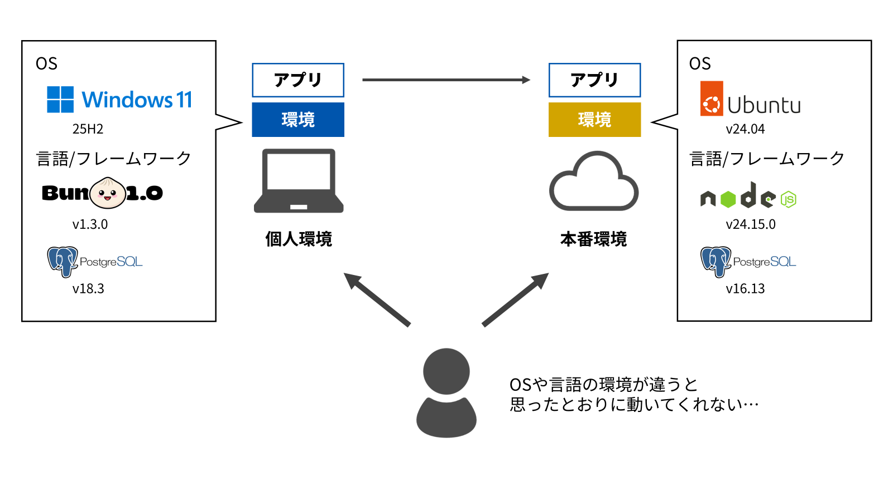
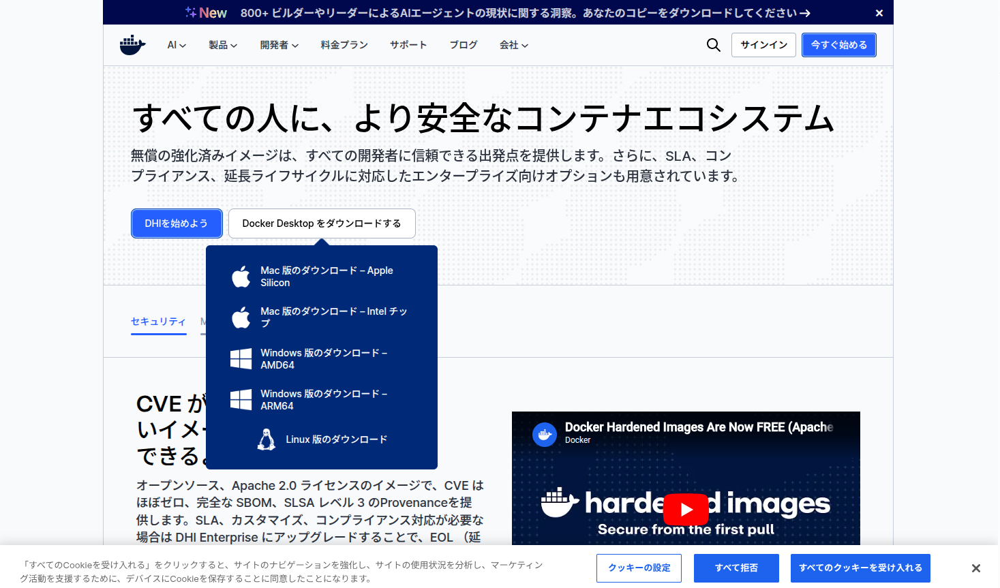
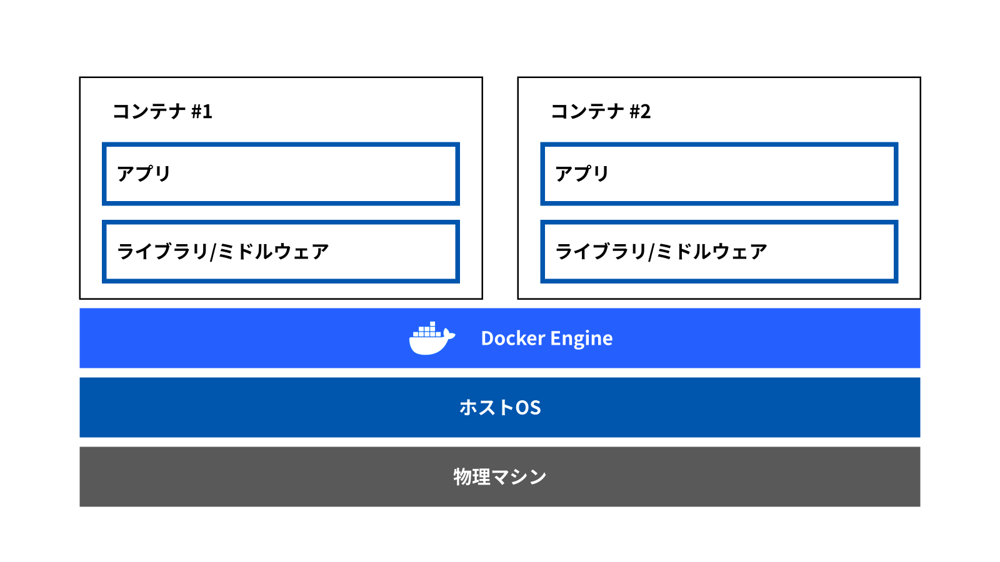

# Digitart Docker-intro

Docker講習会では、モダンなアプリケーション開発において不可欠なコンテナ技術であるDockerを通して、環境構築の重要性と効率性を学びます。

## 目次

- はじめに
  - [Dockerが必要な理由](#01-dockerが必要な理由)
  - [事前準備](#02-事前準備)
- なぜDockerが必要なのか
  - [Docker なし環境の実演](#10-docker-なし環境の実演)
    - [Ubuntu 環境での初回構築実演](#101-ubuntu-環境での初回構築実演)
    - [環境統一の問題](#102-環境統一の問題)
  - [Docker の基礎知識](#11-docker-の基礎知識)
    - [Docker とは](#111-docker-とは)
    - [Dockerfile とは](#112-dockerfile-とは)
    - [docker-compose とは](#113-docker-compose-とは)
    - [基本的なコマンド](#114-基本的なコマンド)
- Docker実践講習
  - [サンプルアプリケーション](#20-サンプルアプリケーション)
    - [概要](#201-概要)
    - [ディレクトリ構成](#202-ディレクトリ構成)
  - [Docker でアプリを動かす](#21-docker-でアプリを動かす)
    - [Dockerfile の説明](#211-dockerfile-の説明)
    - [docker-compose.ymal の説明](#212-docker-composeymal-の説明)
    - [実行してみよう](#213-実行してみよう)
  - [アプリを操作してみる](#22-アプリを操作してみる)
    - [フロントエンドでタスク作成](#221-フロントエンドでタスク作成)
    - [フロントエンドコンテナ内部の確認](#222-フロントエンドコンテナ内部の確認-webapp-frontend)
- まとめ
  - [今日学んだこと](#30-今日学んだこと)
  - [次のステップ](#31-次のステップ)

---

## 0. はじめに

### 0.1. Dockerが必要な理由

> Docker（ドッカー）は、コンテナ仮想化を用いてアプリケーションを開発・配置・実行するためのオープンプラットフォームである。
> ー Wikipedia「Docker」より(2026年4月28日閲覧)

「コンテナ仮想化」とは...  
- アプリケーションが稼働するために必要なものは色々ある  
- 各種ライブラリ、設定ファイル、アプリケーションコード等々  
- その必要なもの色々をまとめて「イメージ」というカタマリの中に入れておく  
その「イメージ」から起動した「コンテナ」さえあれば、アプリケーションを動かすことができる状態を作る  

web開発では、そもそものOS、依存する言語のバージョン、設定など...  
**環境の違い**により想定通りに動作しないことがあります。  



Docker さえあれば、**どの環境でも同じように動くアプリケーション**を作ることができます。  
#### うれしくないですか?!?!  
  
Dockerは、比較的シンプルなコマンドを実行するだけで、アプリケーションを***前提の環境ごと**移動・実行できるようにしています。  

---

### 0.2. 事前準備

Dockerを自分のPCに導入してください！！  

#### 0.2.1. Docker Desktop のインストール

Docker Desktopをインストールするのが一番楽です。  
公式サイトにアクセス([URL: https://www.docker.com/ja-jp/](https://www.docker.com/ja-jp/))し、自分の環境にあったインストーラーを落としてきてください。  
  

  
もちろん落としてきたらインストールまでするんだよ!!  

> [!IMPORTANT]
> インストール時に問題が起きた場合は、気軽に質問してください！

## 1. なぜDockerが必要なのか

### 1.0. Docker なし環境の実演

それでは、Docker **を使わずに** React + PostgreSQL の開発環境を構築する場合、どのような手順が必要か見てみましょう。

講師が実際に Ubuntu マシンで環境構築を行い、その手間の多さを体感してもらいます。

#### 1.0.1. Ubuntu 環境での初回構築実演

**講師の実演内容（Ubuntu での完全なセットアップ）：**

```bash
# 1. システムパッケージの更新
sudo apt-get update
sudo apt-get upgrade -y

# 2. Node.js 18 のインストール
curl -fsSL https://deb.nodesource.com/setup_18.x | sudo -E bash -
sudo apt-get install -y nodejs

# 3. PostgreSQL のインストール
sudo apt-get install -y postgresql postgresql-contrib

# 4. PostgreSQL サービスの起動
sudo service postgresql start

# 5. PostgreSQL の postgres ユーザーでデータベースを作成
sudo -u postgres psql -c "CREATE DATABASE task_db;"

# 6. テーブルを作成
sudo -u postgres psql -d task_db -c "
CREATE TABLE tasks (
  id SERIAL PRIMARY KEY,
  title VARCHAR(255) NOT NULL,
  time TIMESTAMP,
  note TEXT,
  created_at TIMESTAMP DEFAULT CURRENT_TIMESTAMP
);
CREATE INDEX idx_tasks_created_at ON tasks(created_at DESC);
"

# ============================================
# 【毎回】アプリケーションを起動
# ============================================

# 7. リポジトリのディレクトリに移動
cd ~/docker-intro/WebApp

# 8. バックエンドのセットアップと起動（ターミナル 1）
cd backend
npm install
export POSTGRES_USER=postgres
export POSTGRES_PASSWORD=postgres
export POSTGRES_HOST=localhost
export POSTGRES_PORT=5432
export POSTGRES_DB=task_db
npm start
# ターミナル出力: Backend server is running on port 5000

# 9. 別のターミナルウィンドウを開く（ターミナル 2）

# 10. フロントエンドのセットアップと起動
cd ~/docker-intro/WebApp/frontend
npm install
npm start
# ターミナル出力: listening on http://0.0.0.0:3000

# 11. ブラウザで http://localhost:3000 にアクセス
```

**初回セットアップで 10～15 分かかり、その後は毎回 5 分程度の手作業が必要です。**

### 1.0.2. 環境統一の問題

もしあなたが同じ手順で動かそうと思うと...
#### そもそも動きません！！！
だってOS違うでしょ?  

| 項目 | 結果 |
|------|------|
| **Windows ユーザー** | PowerShell での手順が異なる、npm パッケージのインストール失敗、PostgreSQL の設定が違う |
| **Mac ユーザー** | Homebrew での手順が異なる、M1/M2 Mac での互換性問題 |
| **Node.js のバージョン** | システムに既にインストール済みのバージョンが干渉 |
| **PostgreSQL** | バージョン、パスの設定、ポート競合 |

このように、**OS ごと**、**マシンごと** に異なる問題が発生します。

> [!TIP]
> Docker を使えば、**上記の全ての環境構築をスキップ**して、1コマンドで全員が同じ環境を手に入れることができます！

---

## 1.1. Docker の基礎知識

では、Docker がどのような仕組みで環境統一を実現しているのか、ざっくり理解しましょう。

### 1.1.1. Docker とは

Docker は、**アプリケーションとその実行環境をまとめて、ディスク上に固めてしまう技術**です。  
とりあえずよく出される図を示しておきます。  



「コンテナ」は、アプリそのものと、その実行に必要なライブラリ等の諸々を詰め込んだものです。  
Dockerの基本単位と思っていいでしょう。  

> [!NOTE]
> Docker の正確な内部構造は複雑ですが、ひとまず「環境ごと固める技術」という理解で十分です。

### 1.1.2. Dockerfile とは

**Dockerfile** は、「どのような環境のコンテナを作るのか」を定義するファイルです。

```dockerfile
# ベースとなる Node.js イメージを使用
FROM node:18

# コンテナ内の作業ディレクトリを指定
WORKDIR /app

# ホスト側のファイルをコンテナにコピー
COPY package*.json ./

# npm で依存ライブラリをインストール
RUN npm install

# アプリケーション本体をコピー
COPY . .

# ポート 3000 を外からアクセス可能にする
EXPOSE 3000

# コンテナ起動時に実行するコマンド
CMD ["npm", "run", "dev"]
```

> [!TIP]
> Dockerfile は、**料理のレシピ** のようなものです。「この材料を入れて、この順番で調理する」という指示書が Dockerfile です。

Dockerfileの手順に則って、コンテナを作ってもらいます。  

### 1.1.3. docker-compose とは

一般的なアプリケーションは複数のサービスが連携しています：
- フロントエンド（Reactなど）
- バックエンド（Express）
- データベース（PostgreSQL）

それぞれに Dockerfile を作って個別に起動するのは面倒ですよね。

**docker-compose** は、複数のコンテナを一度に管理するツールです。

```yaml
version: '3.8'

services:
  # フロントエンド
  frontend:
    build: ./frontend
    ports:
      - "3000:3000"
    depends_on:
      - backend

  # バックエンド
  backend:
    build: ./backend
    ports:
      - "5000:5000"
    depends_on:
      - db

  # データベース
  db:
    image: postgres:15
    environment:
      POSTGRES_PASSWORD: password
      POSTGRES_DB: todo_db
    volumes:
      - db_data:/var/lib/postgresql/data

volumes:
  db_data:
```

このファイルがあれば、コマンドをすこ～し打つだけで全ての環境が整って起動します。  

### 1.1.4. 基本的なコマンド

この講習では、とりあえず**2つ**だけコマンドを覚えて下さい。

```bash
docker compose build
docker compose up
```

| コマンド | 説明 |
|---------|------|
| `docker compose build` | `docker-compose.ymal` で定義された全てのコンテナイメージをビルド |
| `docker compose up` | ビルド済みのコンテナを起動 |

> [!NOTE]
> この2つのコマンドを実行することで、イメージのビルドとコンテナの起動が完了します。

その他の基本的なコマンド（参考）：
- `docker compose down` - コンテナを停止・削除
- `docker ps` - 実行中のコンテナ一覧表示
- `docker logs <container_name>` - コンテナのログ表示

---

## 2. Docker実践講習

### 2.0. サンプルアプリケーション

#### 2.0.1. 概要

**タスク管理 Web アプリ**

このアプリケーションは以下の構成です：

- **フロントエンド**: バニラ HTML + JavaScript（ユーザーインターフェース）
- **バックエンド**: Express.js（API サーバー）
- **データベース**: PostgreSQL（タスクデータ保存）

ユーザーはフロントエンドでタスクを入力→バックエンド API を通じて→PostgreSQL に保存、という流れです。

#### 2.0.2. ディレクトリ構成

```
docker-intro/
├── README.md                    ← このファイル
├── WebApp/
│   ├── docker-compose.yaml      ← 全サービスの定義
│   ├── frontend/
│   │   ├── Dockerfile          ← バニラHTML サーバー設定
│   │   ├── package.json
│   │   ├── index.html          ← メインページ
│   │   ├── app.js              ← JavaScript ロジック
│   │   └── style.css           ← スタイル定義
│   ├── backend/
│   │   ├── Dockerfile          ← Express ビルド設定
│   │   ├── package.json
│   │   ├── server.js           ← メインサーバーコード
│   │   └── .env                ← 環境変数設定
│   └── database/
│       └── init.sql            ← PostgreSQL 初期設定スクリプト
├── images/
└── README.md
```

---

### 2.1. Docker でアプリを動かす

#### 2.1.1. Dockerfile の説明

**フロントエンド (frontend/Dockerfile)**

```dockerfile
FROM node:18

WORKDIR /app

COPY package*.json ./

RUN npm install

COPY . .

EXPOSE 3000

CMD ["npm", "start"]
```

シンプルな HTTP サーバー（http-server）を使用してバニラ HTML ファイルを配信しています。

**バックエンド (backend/Dockerfile)**

```dockerfile
FROM node:18

WORKDIR /app

COPY package*.json ./

RUN npm install

COPY . .

EXPOSE 5000

CMD ["npm", "start"]
```

Express.js サーバーで API を提供します。

#### 2.1.2. docker-compose.ymal の説明

```yaml
version: '3.8'

services:
  # バニラ HTML フロントエンド
  frontend:
    build: ./frontend
    ports:
      - "3000:3000"
    depends_on:
      - backend
    networks:
      - app-network

  # Express バックエンド
  backend:
    build: ./backend
    ports:
      - "5000:5000"
    depends_on:
      - db
    networks:
      - app-network
    environment:
      - POSTGRES_USER=user
      - POSTGRES_PASSWORD=password
      - POSTGRES_HOST=db
      - POSTGRES_PORT=5432
      - POSTGRES_DB=task_db

  # PostgreSQL データベース
  db:
    image: postgres:15-alpine
    ports:
      - "5432:5432"
    environment:
      POSTGRES_USER: user
      POSTGRES_PASSWORD: password
      POSTGRES_DB: task_db
    volumes:
      - db_data:/var/lib/postgresql/data
      - ./database/init.sql:/docker-entrypoint-initdb.d/init.sql
    networks:
      - app-network

volumes:
  db_data:

networks:
  app-network:
```

> [!TIP]
> - `depends_on`: サービス間の起動順序を指定（db → backend → frontend の順番になる）
> - `environment`: 環境変数を設定（データベース接続情報など）
> - `volumes`: データベースのファイルをホスト側に永続化（コンテナ削除してもデータが残る）

#### 2.1.3. 実行してみよう

それでは、実際に Docker でアプリケーションを起動してみます。

```bash
# docker-intro/WebApp ディレクトリに移動
cd ./WebApp/

# 1. 全ての環境をビルド
docker compose build

# 2. コンテナを起動
docker compose up
```

初回は Docker イメージをダウンロード・ビルドするため、数分かかります。

ログにエラーがなく、以下のようなメッセージが表示されれば成功です：

```
backend-1   | Backend server is running on port 5000
frontend-1  | Available on:
frontend-1  |   http://127.0.0.1:3000
frontend-1  |   http://172.22.0.4:3000
frontend-1  | Hit CTRL-C to stop the server
db-1        | 2026-04-29 16:37:13.265 UTC [1] LOG:  database system is ready to accept connections
```

> [!NOTE]
> 各コンテナのログが出力されます。何か問題があれば、ここでエラーメッセージが表示されます。

---

### 2.2. アプリを操作してみる

#### 2.2.1. フロントエンドでタスク作成

ブラウザで http://localhost:3000 にアクセスしてください。

タスク管理アプリケーションが表示されます。

以下の操作をしてみましょう：
- テキストボックスにタスク名を入力
- 期限やメモ（オプション）を追加
- 「追加」ボタンをクリック
- タスクが一覧に表示される
- 「削除」ボタンでタスクを削除できる

> [!TIP]
> フロントエンドで行った操作は、バックエンド API を通じてデータベースに保存されています。
> ページをリロードしても、データが残っていることが確認できます。

#### 2.2.2. フロントエンドコンテナ内部の確認 (webapp-frontend)

ホストからフロントエンドコンテナに入り、コンテナ内で何が動いているか確認する手順を示します。まずはホスト側でコンテナ名を確認してください（例: `webapp-frontend-1`）。

ホスト側での確認例：

```bash
# コンテナ一覧（名前を確認）
docker ps

# コンテナのプロセス一覧（ホストから）
docker top webapp-frontend-1

# コンテナのログを追う
docker logs --follow webapp-frontend-1
```

コンテナ内へ入る

```bash
docker exec -it webapp-frontend-1 bash
```

コンテナ内での代表的な確認コマンド：

```bash
# 作業ディレクトリの中身を確認
ls -al

# フロントエンドが localhost:3000 で応答するか確認
curl -I http://localhost:3000

# package.json を確認
cat package.json
```

---

## 3. まとめ

### 3.0. 今日学んだこと

**Docker を使うことで、以下のことが実現できました：**

1. **コマンドで全員が同じ環境を構築**
   - OS の違い（Windows, Mac, Linux）に関係なく、全く同じ結果が得られた

2. **複雑な環境設定をスキップ**
   - Node.js, PostgreSQL, npm パッケージの個別インストールが不要

3. **複数サービスの連携が簡単**
   - フロントエンド、バックエンド、データベースが自動で連携

4. **再現性が高い**
   - 同じ Dockerfile / docker-compose.yaml があれば、いつでも同じ環境を再現可能

### 3.1. 次のステップ

Docker の学習を続ける場合、以下のトピックを学ぶと良いでしょう：

- **本番環境への展開**: AWS, GCP などでの運用
- **パフォーマンス最適化**: イメージサイズの削減、レイヤーキャッシングの活用
- **オーケストレーション**: K8sとか

---

> [!IMPORTANT]
> Docker は、モダンな開発になくてはならないツールです。  
> 今日学んだ概念をベースに、実践を重ねることで、さらに理解が深まります。  

---
